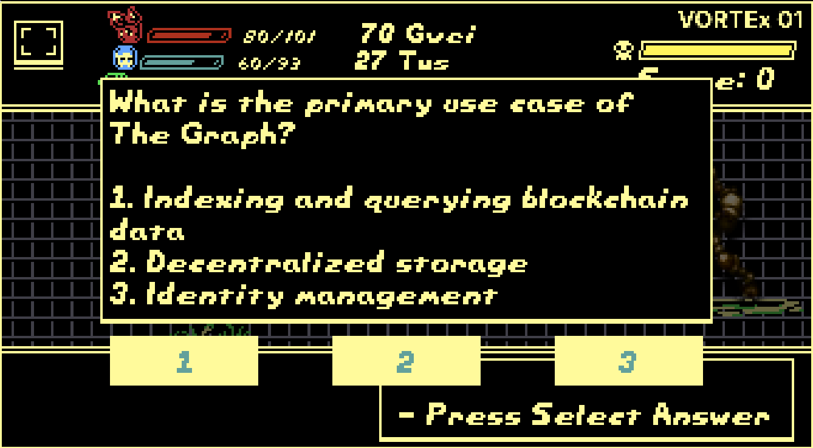
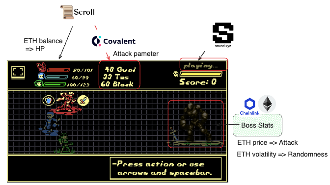
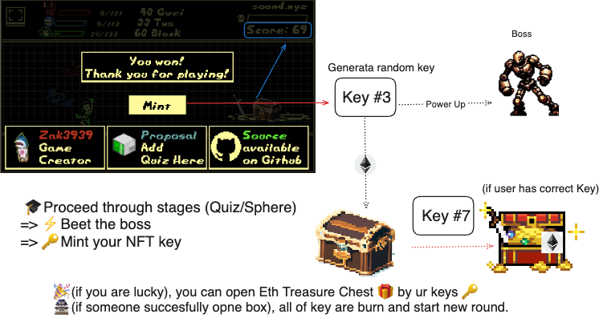

# Greze

[Play the demo](https://sphere-quiz.vercel.app/)

## Elevator Pitch

Greze innovatively combines off-chain and on-chain elements, offering a unique gaming experience where characters' strength is influenced by players' Scroll Mainnet activity and ETH holdings. The game features quizzes, sphere-matching for HP recovery, and NFT keys for opening treasure chests. As players progress, enemy strength increases based on collected ETH. Greze exemplifies crypto gamification, providing an immersive experience that showcases the allure of cryptocurrency.



## User Flow

### New Round
- Chest key is decided by randomness

### Main Part
1. User starts the game.
2. Connect wallet to Scroll and load player character parameters (HP, Attack).
3. Proceed through stages (Quiz/Sphere).
4. Beat the boss.
5. Mint your NFT key.

Repeat steps 1-5.

6. If lucky, you can open an Eth Treasure Chest by using your keys.
7. If someone successfully opens a box, all keys are burned, and a new round starts.

## Sound

Listen to the sound effects [here](https://www.sound.xyz/samnogg/game-odyssea).

## Quiz Set

- Submit quiz proposals [here](https://forms.gle/AUJ8YaX9wsexi8ie7).

## What Onchain/Offchain?

In the off-chain game, players use three fixed characters to battle enemies while answering quizzes. One of the distinctive features of the game is that the strength of the characters varies based on the state of the Scroll Mainnet. Specifically, the attack power of the characters is influenced by factors such as the gas price of the player's latest transaction, the number of transactions in the last 7 days, and the proximity of the latest transaction's block number to the current block number. This mechanism ensures that the player's activity on the Scroll Mainnet is reflected in the game.

Moreover, the characters' HP is determined by the amount of ETH held by the player. Players with a larger amount of ETH can have higher HP, giving them an advantage in progressing through the game.

The off-chain game also includes a sphere-matching part. Players can recover HP by connecting three or more spheres of the same color. This adds a strategic element to the game and increases its depth.

As for the on-chain elements, players can acquire an NFT after clearing the game. The NFT serves as a key, and only players with the corresponding key can open a treasure chest. A key is obtained each time the game is cleared, and the treasure chest contains the ETH collected within the game. Players can increase their chances of opening the treasure chest by repeatedly challenging the game and collecting the corresponding keys. Furthermore, as players progress through the game, the strength of the enemies increases. This is determined by the amount of ETH collected within the game, providing a more challenging gaming experience.

Greze is an example of gamification filled with the allure of crypto. It features a unique mechanism where activities on the blockchain directly influence gameplay, and the progress of the game is reflected in the on-chain rewards. This allows players to engage more deeply with the world of crypto and experience its appeal through the game.

## Architecture

### Data Feed



### Battle End



## Tech Stack

### Ankr

Our Rpc is supported by Ankr's RPCs

https://www.ankr.com/

### Covalent

To fetch the latest transaction for a specific address on the Scroll Mainnet, we use the getAllTransactionsForAddress method for deciding player characters initial status.

```
let latestTransaction = null;
for await (const resp of client.TransactionService.getAllTransactionsForAddress(
  "scroll-mainnet",
  address,
  { "noLogs": true, "blockSignedAtAsc": false }
)) {
  latestTransaction = resp;
  break;
}
```

### The Graph

The retrieved top score is then displayed using the topScoreText object in the game scene.

```
query {
  mintKeyEvents(orderBy: score, orderDirection: desc, first: 1) {
    score
  }
}
```

### ChainLinkDataFeed

Retrieve attack parameters from the Data Feed contract:

Call the getAttackParameters() function from the contract to obtain the base attack power, adjusted volatility, and overall attack parameter.

Calculate enemy's attack damage by each turn

Use the retrieved attack parameters to calculate the enemy's attack damage.

```
async getAttackParameters(): Promise<AttackParameters> {
    try {
      const { baseAttackPower, adjustedVolatility, overallAttackParameter } = await getAttackParametersFromContract();
      return {
        baseAttackPower,
        adjustedVolatility,
        overallAttackParameter,
      };
    } catch (error) {
      console.error('Error getting attack parameters:', error);
      return {
        baseAttackPower: 20,
        adjustedVolatility: 25,
        overallAttackParameter: 0.8,
      };
    }
  }
```

## Contract

#### SepoliaScroll

- [SphereQuizGameNFT](https://sepolia.scrollscan.com/address/0x82845dfa6d2185547480372eedf213d4c2976da3)

#### Sepolia

- [BossStats](https://sepolia.etherscan.io/address/0xbdc3bd11d25dba5427ef3e7a072cdece99caf001)

## Acknowledgments

- [Phaser](https://phaser.io/)
- [RBG](https://github.com/Osmose/RBG/)

## Feature Works

- QuizData should be private
- Launch to ScrollMainnet


## Inspiration

The inspiration behind Greze stems from our desire to create an immersive gaming experience that seamlessly integrates blockchain technology and real-time data from the Scroll Mainnet. We envisioned a game where players' actions on the blockchain directly influence their in-game characters' strength and abilities, offering a novel and engaging gameplay experience.

## What it does

Greze is a cutting-edge gaming platform that combines off-chain and on-chain elements to deliver a dynamic and interactive gaming experience. Players embark on a journey where their characters' strength is determined by their activity on the Scroll Mainnet and their holdings of ETH. As they progress through stages, they encounter quizzes and sphere-matching challenges to recover HP and defeat enemies. Upon completing the game, players receive NFT keys that grant them access to treasure chests containing ETH rewards.

## How we built it

Greze was built using a variety of technologies and platforms. The frontend was developed using Next.js, while smart contracts were written in Solidity and deployed on the Scroll Sepolia Testnet. We utilized Ankr's RPCs for blockchain interaction and Covalent for fetching real-time transaction data from the Scroll Mainnet. Additionally, The Graph was used to retrieve top scores and Chainlink Data Feeds for obtaining attack parameters.

## Challenges we ran into

Throughout the development process, we encountered several challenges, including:

- Integrating real-time blockchain data into the game mechanics while ensuring accuracy and reliability.
- Designing and implementing a seamless user experience that bridges off-chain and on-chain elements.
- Optimizing smart contracts for gas efficiency and scalability to minimize transaction costs.
- Addressing security concerns and vulnerabilities in both the frontend and smart contract code.
- Testing and debugging the application across multiple environments and platforms.

## Accomplishments that we're proud of

Despite the challenges we faced, we're proud to have accomplished:

- Successfully integrating real-time data from the Scroll Mainnet into the game to dynamically adjust character parameters.
- Creating an engaging and immersive gameplay experience that seamlessly blends off-chain and on-chain elements.
- Establishing a secure and robust smart contract architecture to handle game logic and player interactions on-chain.
- Implementing features such as quizzes, sphere-matching challenges, and NFT rewards to enhance gameplay and incentivize player participation.
- Launching a functional demo of Greze that showcases the potential of blockchain technology in gaming.

## What we learned

Through the development of Greze, we gained valuable insights into:

- Leveraging blockchain technology to create interactive and dynamic gaming experiences.
- Integrating real-time data from blockchain networks into decentralized applications.
- Designing and implementing smart contracts for gaming applications with gas efficiency and scalability in mind.
- Enhancing user engagement and retention through gamification techniques and incentives.
- Collaborating effectively as a team to overcome technical challenges and deliver a polished product.

## What's next for Greze

Looking ahead, we plan to:

- Further enhance the gameplay experience with additional features, characters, and levels.
- Expand the integration of blockchain technology to offer more opportunities for player interaction and rewards.
- Launch Greze on the Scroll Mainnet and explore opportunities for partnerships and collaborations within the blockchain gaming ecosystem.
- Continuously iterate and improve the game based on user feedback, market trends, and emerging technologies.

Greze represents just the beginning of our journey in revolutionizing the gaming industry with blockchain technology. We're excited to continue innovating and pushing the boundaries of what's possible in decentralized gaming.
